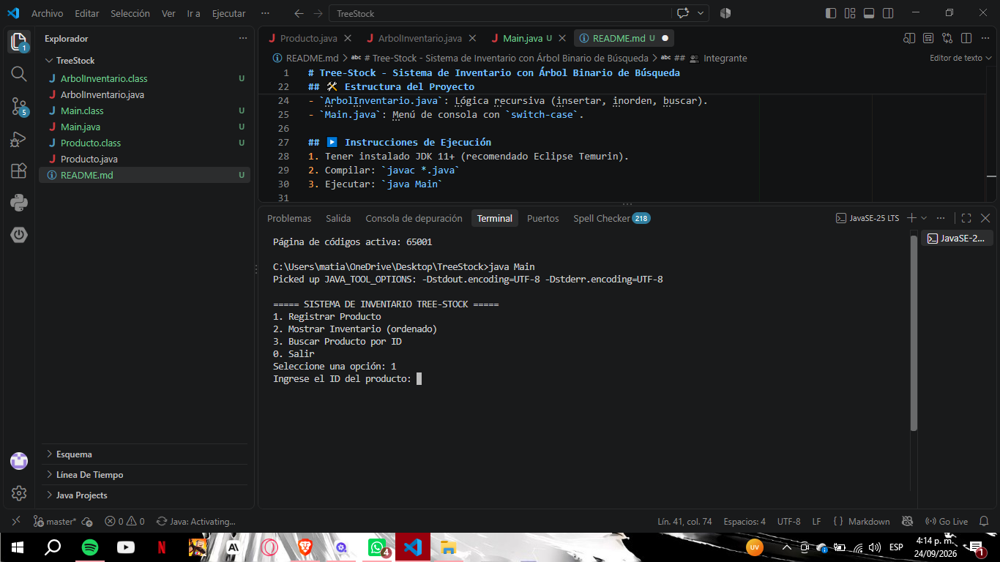
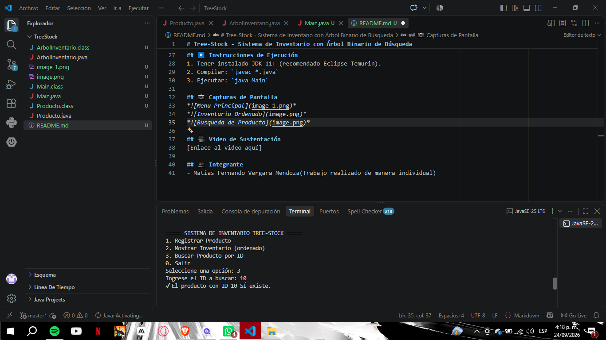

# Tree-Stock - Sistema de Inventario con Árbol Binario de Búsqueda

## 🎯 Objetivo
Implementar un sistema de inventario en consola utilizando un **Árbol Binario de Búsqueda (ABB)** en Java, aplicando recursividad y manejo manual de punteros.

## 📚 Fundamento Teórico

### ¿Qué es un Árbol Binario de Búsqueda?
Un ABB es una estructura de datos dinámica donde cada nodo tiene **como máximo dos hijos** (izquierdo y derecho). Su propiedad fundamental es:
- Todos los nodos del **subárbol izquierdo** tienen valores **menores** que la raíz.
- Todos los nodos del **subárbol derecho** tienen valores **mayores** que la raíz.

Esto permite búsquedas rápidas (O(log n) en promedio).

### Aplicación de la Recursividad
La recursividad es clave porque cada operación (insertar, buscar, recorrer) se define en función de sí misma sobre subárboles más pequeños:
- **Caso base:** cuando el nodo actual es `null` (hoja alcanzada).
- **Paso recursivo:** avanzar al hijo izquierdo o derecho según la comparación del ID.

Esto evita usar bucles `while` y refleja naturalmente la estructura jerárquica del árbol.

## 🛠️ Estructura del Proyecto
- `Producto.java`: Clase nodo con datos y punteros.
- `ArbolInventario.java`: Lógica recursiva (insertar, inorden, buscar).
- `Main.java`: Menú de consola con `switch-case`.

## ▶️ Instrucciones de Ejecución
1. Tener instalado JDK 11+ (recomendado Eclipse Temurin).
2. Compilar: `javac *.java`
3. Ejecutar: `java Main`

## 📸 Capturas de Pantalla

## 🎥 Video de Sustentación
[Enlace al video aquí]

## 👥 Integrante
- Matias Fernando Vergara Mendoza(Trabajo realizado de manera individual)